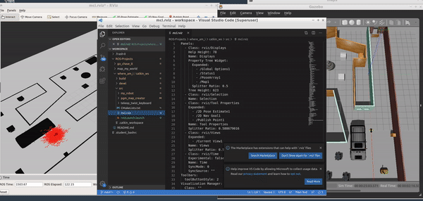
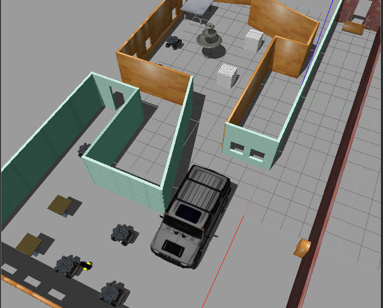
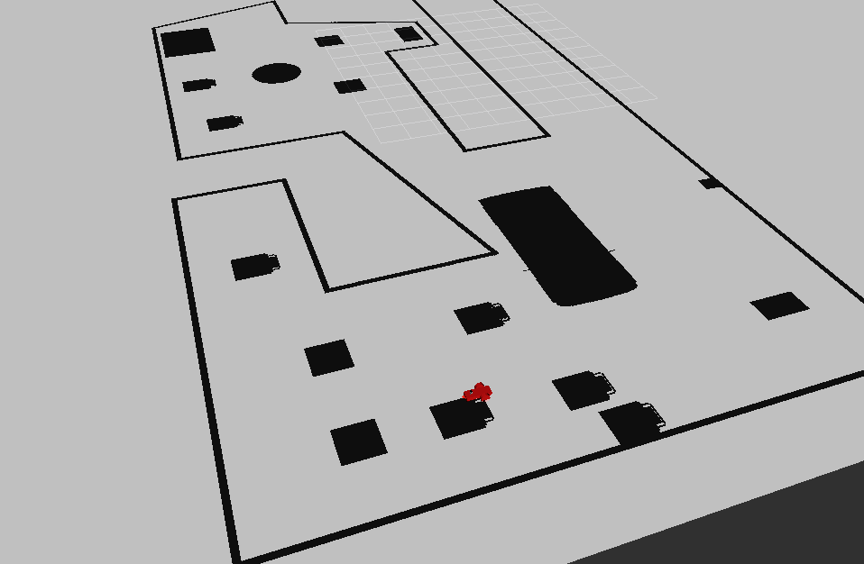

# ROS-Monte Carlo Localization

## Overview
Here AMCL ROS package is used to implement Adaptive Monte Carlo Localization of a robot in a known environment with a supplied 2D map. The map is generated using the provided pgm_map_creator package. More details on Monte Carlo Localization can be found on ROS wiki for AMCL. Also please check out my project on implementation of MCL using C++.


**Keywords:** AMCL, SLAM, localization, ROS, MCL, Monte Carlo


### License

The source code is released under a [Apache License 2.0](/LICENSE).

**Author: Abhigya Raval<br />
Maintainer: Abhigya Raval, abhigyaraval@gmail.com**

The packages has been tested under [ROS] Kinetic on Ubuntu 16.04.




**Gazebo env**



**Rviz viz**



## Installation

### Installation from Packages

Using the mentioned version of ROS and Ubuntu, make sure to install the dependecies for the following packages using:

<!-- Or better, use `rosdep`: -->
```
sudo apt-get update
source devel/setup.bash
rosdep -i install amcl
```

### Building from Source

<!-- #### Dependencies

- [Robot Operating System (ROS)](http://wiki.ros.org) (middleware for robotics),
- [Eigen] (linear algebra library)

	sudo rosdep install --from-paths src -->

#### Building

To build from source, clone the latest version from this repository into your catkin workspace and compile the package using
```
cd catkin_ws
catkin_make
source devel/setup.bash
```
<!-- ### Running in Docker

Docker is a great way to run an application with all dependencies and libraries bundles together.
Make sure to [install Docker](https://docs.docker.com/get-docker/) first.

First, spin up a simple container:

	docker run -ti --rm --name ros-container ros:noetic bash

This downloads the `ros:noetic` image from the Docker Hub, indicates that it requires an interactive terminal (`-t, -i`), gives it a name (`--name`), removes it after you exit the container (`--rm`) and runs a command (`bash`).

Now, create a catkin workspace, clone the package, build it, done!

	apt-get update && apt-get install -y git
	mkdir -p /ws/src && cd /ws/src
	git clone https://github.com/leggedrobotics/ros_best_practices.git
	cd ..
	rosdep install --from-path src
	catkin_make
	source devel/setup.bash
	roslaunch ros_package_template ros_package_template.launch -->

### Unit Tests

```
cd catkin_ws
catkin_make
source devel/setup.bash
```
To test and move robot using your keyboard

	```
	cd catkin_ws
	catkin_make
	source devel/setup.bash
	roslaunch my_robot world.launch
	roslaunch my_robot amcl.launch
	rosrun teleop_twist_keyboard teleop_twist_keyboard.py
	```
Then use the keyboard to test run and adjust parameters for amcl.
<!-- ### Static code analysis

Run the static code analysis with

	catkin_make roslint_ros_package_template -->

## Usage

To run using move_base module with RViz

```
cd catkin_ws
catkin_make
source devel/setup.bash
roslaunch my_robot world.launch
roslaunch my_robot amcl.launch
```
Then give a decent 2D pose estimate on the map in RViz and give a destination point as well. AMCL will localize the robot as it moves!
